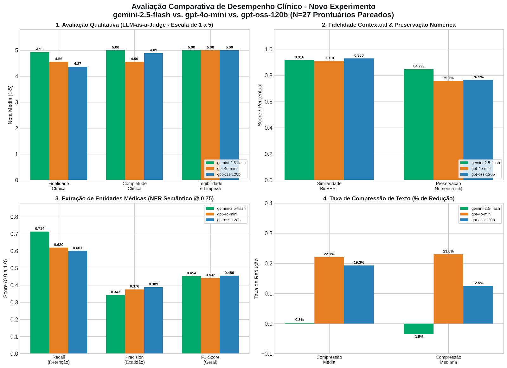

# Experimento clinical — nefrologia / 2026-08-30

Comparação de sumarizações `detalhe` vs `detalhe_{model}` por modelo.

## Resumo visual

_Coloque `experiment_summary.png` nesta pasta para exibir os gráficos._

## Modelos

### gemini-2.5-flash

- Manifesto: [detalhe_gemini_2_5_flash_experiment.yaml](./detalhe_gemini_2_5_flash_experiment.yaml)
- Métricas: [detalhe_gemini_2_5_flash_eval.csv](./detalhe_gemini_2_5_flash_eval.csv)
- Cohort: [detalhe_gemini_2_5_flash_cohort.jsonl](./detalhe_gemini_2_5_flash_cohort.jsonl)

### gpt-4o-mini

- Manifesto: [detalhe_gpt_4o_mini_experiment.yaml](./detalhe_gpt_4o_mini_experiment.yaml)
- Métricas: [detalhe_gpt_4o_mini_eval.csv](./detalhe_gpt_4o_mini_eval.csv)
- Cohort: [detalhe_gpt_4o_mini_cohort.jsonl](./detalhe_gpt_4o_mini_cohort.jsonl)

### gpt-oss-120b

- Manifesto: [detalhe_gpt_oss_120b_experiment.yaml](./detalhe_gpt_oss_120b_experiment.yaml)
- Métricas: [detalhe_gpt_oss_120b_eval.csv](./detalhe_gpt_oss_120b_eval.csv)
- Cohort: [detalhe_gpt_oss_120b_cohort.jsonl](./detalhe_gpt_oss_120b_cohort.jsonl)
